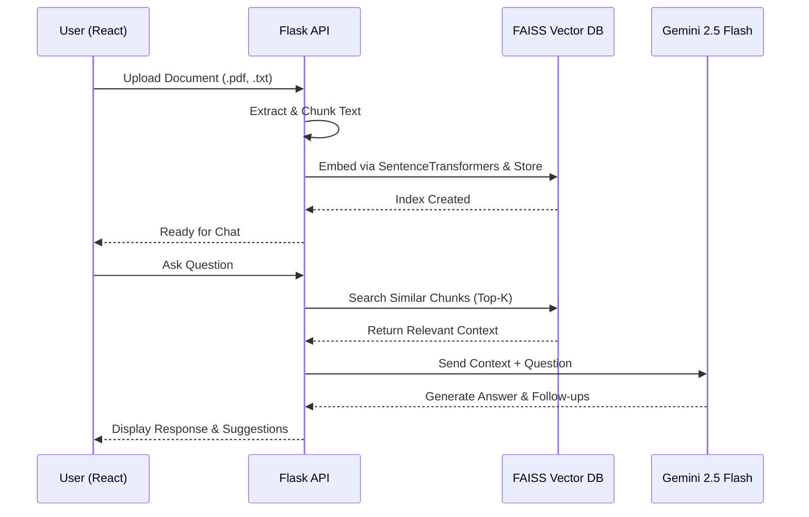

<div align="center">
  
  <h1>DocMind AI 🧠📄</h1>
  <p><strong>A Next-Generation Retrieval-Augmented Generation (RAG) Chatbot</strong></p>
  <p>Seamlessly chat with your documents using Google's Gemini 2.5 Flash, FAISS Vector Search, and a beautiful React frontend.</p>

  <p>
    <a href="https://reactjs.org/"></a>
    <a href="https://flask.palletsprojects.com/"></a>
    <a href="https://deepmind.google/technologies/gemini/"></a>
    <a href="https://github.com/facebookresearch/faiss"></a>
    <a href="https://www.docker.com/"></a>
  </p>
</div>

---

## ✨ Features

- **🚀 Ultra-Fast Inference:** Powered by Google's latest `gemini-2.5-flash` model via the new `google-genai` SDK.
- **📚 Smart Document Indexing:** Upload PDFs, TXTs, or MDs. Documents are intelligently chunked and embedded using `all-MiniLM-L6-v2`.
- **⚡ Vector Search Engine:** Uses **FAISS** (Facebook AI Similarity Search) for blazing-fast cosine similarity lookups.
- **💬 Interactive Chat Context:** The bot not only answers questions accurately based on document context, but it also automatically suggests **Follow-up Questions** to guide your exploration.
- **🎨 Glassmorphism UI:** A sleek, dark-mode, responsive React interface that feels truly premium.
- **🐳 Docker Ready:** Fully containerized with a `docker-compose.yml` for instant zero-config deployments.

---

## 🏗️ Architecture Flow



---

## 🛠️ Tech Stack

### Frontend
- **React 18** (Create React App)
- **Vanilla CSS** (Custom Neon & Glassmorphic design system)
- **React Markdown** (For rich text chat rendering)

### Backend
- **Python 3.11+ / Flask** (API Layer)
- **Google GenAI SDK** (LLM Engine)
- **FAISS (CPU)** (In-memory Vector Database)
- **Sentence-Transformers** (Local Embeddings generation)
- **PyPDF** (Document parsing)

---

## 🚀 Getting Started (Local Development)

### Prerequisites
- Node.js (v18+)
- Python (v3.10+)
- A Gemini API Key from [Google AI Studio](https://aistudio.google.com/)

### 1. Backend Setup

```bash
cd backend
python -m venv venv
# On Windows: venv\Scripts\activate
# On Mac/Linux: source venv/bin/activate

pip install -r requirements.txt
```

Create a `.env` file inside the `backend` directory:
```env
GEMINI_API_KEY=your_gemini_api_key_here
```

Start the Flask server:
```bash
python app.py
# Runs on http://localhost:5000
```

### 2. Frontend Setup

Open a new terminal window:
```bash
cd frontend
npm install
npm start
# Runs on http://localhost:3000
```

---

## 🐳 Docker Deployment (Recommended)

Don't want to install dependencies? Run the entire stack in one command using Docker Compose!

1. Add your API key to `backend/.env`.
2. Ensure Docker Desktop is running.
3. Run:

```bash
docker-compose up -d --build
```

The frontend will be available at `http://localhost:3000` and the API at `http://localhost:5000`.

---

## 📂 Project Structure

```text
rag-chatbot/
├── backend/
│   ├── app.py                 # Core Flask API & RAG Logic
│   ├── requirements.txt       # Python Dependencies
│   ├── Dockerfile             # Backend Container
│   └── uploads/               # Temporary doc storage
├── frontend/
│   ├── public/                # Static assets
│   ├── src/
│   │   ├── App.js             # Main React Application
│   │   ├── App.css            # Styles & Animations
│   │   └── index.js           # React Entry
│   ├── package.json           # Node Dependencies
│   └── Dockerfile             # Frontend Container
├── docker-compose.yml         # Multi-container orchestration
└── README.md                  # You are here!
```

---

<div align="center">
  <i>Built with ❤️ by Sasidhar</i>
</div>
